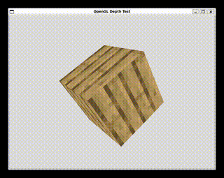

# OpenGL Texture Viewer

This is an adaptation of an introductory exercise in the coordinate systems section of [learnopengl.com](https://learnopengl.com/Getting-started/Coordinate-Systems), 
created by [Joey DeVries](https://github.com/JoeyDeVries). The [GLFW](https://github.com/glfw/glfw) library will be built locally to ensure compatability 
and stability across environments.

# How to Run

To compile the program simply execute the `make` command from the project directory. Use `make clean` to remove all binaries.

