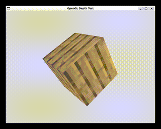

# TexView: The OpenGL Texture Viewing Tool (WIP)

This project began as an adaptation of some exercises in the introductory sections of [learnopengl.com](https://learnopengl.com/Getting-started/Coordinate-Systems),
by [Joey DeVries](https://github.com/JoeyDeVries). It evolved into an attempt at creating a simple texture viewer allowing a technical artist to preview textures and
experiment with how they might appear when rendered using different lighting and material properties. Specifically, this program allows the user to observe a voxel, with 
a default Minecraft texture, under the effects of the Phong Lighting Model.  

All libraries that require precompiled binaries, such as assimp and glfw, are recommended to be built locally to ensure compatability and stability across environments.  

## How to Run

To compile, simply execute the `make` command from the project directory. Use `make clean` to remove all compiled binaries and generated files.  

## The Theory

This project demonstrates a basic version of the Phong Lighting Model wherein a combination of the Phong Reflection and Lambertian Diffusion BRDFs are utilized to approximate 
a solution to the Rendering Equation. As this is an attempt at real-time rendering, however, the version of the rendering equation used has been simplified considerably for 
computation to stay performant. 

The Rendering Equation:

$L_o(\mathbf{x}, \vec{\omega}_o) = L_e(\mathbf{x}, \vec{\omega}_o) + \int_{\Omega} f_r(\mathbf{x}, \vec{\omega}_i, \vec{\omega}_o) L_i(\mathbf{x}, \vec{\omega}_i) (\vec{\omega}_i \cdot \mathbf{n})d\vec{\omega}_i$

Reduced Form (what we use in our model):  

$L_o(\mathbf{x}, \vec{\omega}_o) = (f_{\text{diffuse}}(\mathbf{x}, \vec{\omega}_i, \vec{\omega}_o) + f_{\text{specular}}(\mathbf{x}, \vec{\omega}_i, \vec{\omega}_o))L_i\cos(\theta)_i$

such that,

$f_{\text{diffuse}}(\mathbf{x}, \vec{\omega}_i, \vec{\omega}_o) = c_{\text{diffuse}}$

$f_{\text{specular}}(\mathbf{x}, \vec{\omega}_i, \vec{\omega}_o) = (\vec{\omega}_o \cdot \vec{R})^\sigma$

The most notable change may be the omission of the emissive light component and the removal of the indefinite integral in front of the BRDF placeholder. This is because the 
surfaces being modeled will generally not be emissive and we are only taking into account light coming from one direction. (Note: If we wanted to get the true amount of incoming 
light at a point, and thereby keep the integral, we would have to check every possible incoming direction in the surrounding hemisphere)

given,

$\mathbf{x}$ = The position in space,  
$\vec{\omega}_o$ = Outgoing light vector,  
$\vec{\omega}_i$ = Incoming light vector,  
$L_o(\mathbf{x}, \vec{\omega}_o)$ = The outgoing radiance at point $\mathbf{x}$ in direction $\vec{\omega}_o$,  
$L_i(\mathbf{x}, \vec{\omega}_i)$ = The incoming radiance at point $\mathbf{x}$ from direction $\vec{\omega}_i$,  
$\vec{R}$ = The reflection vector,  
$\sigma$ = Shininess (intensity of specular highlights).  

where, 

$\vec{R} = -\vec{\omega}_i - 2(-\vec{\omega}_i \cdot \vec{n})\vec{n}$

## User Guide

## Notes

An ImGui.ini file will be automatically created after first running the program. This will preserve ImGui window information for subsequent instances but will be 
removed following the use of the `make clean` command.

